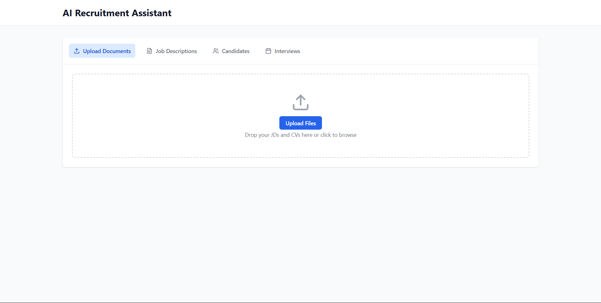
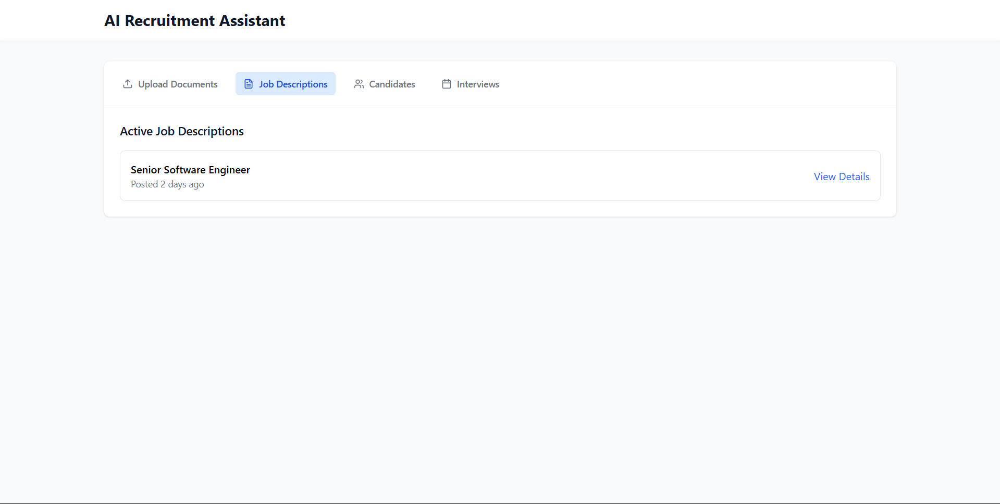
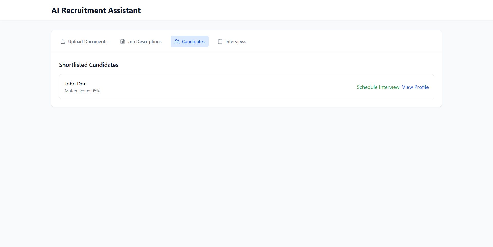

# AI Recruitment Assistant

An intelligent recruitment system that automates the process of reviewing job descriptions and CVs, matching candidates, and scheduling interviews.


## Current Implementation Status

### Completed Features ✅
1. Basic UI Framework
   - Responsive dashboard layout
   - Navigation tabs for different sections
   - Tailwind CSS styling implementation
   - Lucide React icons integration

2. Database Schema
   - SQLite database setup
   - Tables for job descriptions, candidates, matches, and interviews
   - Basic CRUD operations defined
   - Foreign key relationships established

3. Frontend Components
   - Document upload interface
   - Job descriptions list view
   - Candidates overview
   - Interview scheduling section

### In Progress 🚧
1. Frontend Integration
   - File upload functionality
   - Real-time data updates
   - Form validations
   - API integration

2. Backend Development
   - API endpoints setup
   - Database connection
   - File processing system
   - Authentication system

## Features

### 1. Document Upload
- Drag-and-drop interface for uploading JDs and CVs
- Supports multiple file uploads
- Automatic document parsing and data extraction

### 2. Job Descriptions Management
- Create and manage job postings
- Automatic summarization of key requirements
- Track posting status and application progress

### 3. Candidate Management
- Automated CV parsing and data extraction
- AI-powered candidate matching
- Match score calculation based on JD requirements
- Candidate shortlisting

### 4. Interview Scheduling
- Automated interview scheduling
- Calendar integration
- Email notifications for candidates

## Tech Stack

- Frontend: React + TypeScript + Vite
- Styling: Tailwind CSS
- Icons: Lucide React
- Database: SQLite
- Backend: Python
- AI/ML: Ollama (for embeddings and LLM tasks)

## Getting Started

### Prerequisites

- Node.js (v18 or higher)
- Python 3.8+
- SQLite

### Installation

1. Clone the repository:
```bash
git clone <repository-url>
cd ai-recruitment-assistant
```

2. Install frontend dependencies:
```bash
npm install
```

3. Start the development server:
```bash
npm run dev
```

The application will be available at `http://localhost:5173`

## Project Structure

```
├── src/
│   ├── App.tsx           # Main application component
│   ├── components/       # React components
│   ├── main.tsx         # Application entry point
│   └── index.css        # Global styles
├── model.py             # Python backend for AI processing
└── README.md           # Project documentation
```

## Priority Tasks for Implementation

### Immediate Priority (Phase 1)
1. File Upload System
   - Implement file upload functionality with progress indicator
   - Add file type validation (PDF, DOC, DOCX)
   - Create file processing queue system
   - Add error handling and retry mechanism

2. Database Integration
   - Connect frontend with SQLite database
   - Implement data fetching and caching
   - Add real-time updates
   - Create data validation layer

3. Basic AI Processing
   - Set up Ollama integration
   - Implement basic text extraction
   - Create initial matching algorithm
   - Add basic scoring system

### Medium Priority (Phase 2)
1. User Interface Enhancements
   - Add detailed candidate profiles
   - Create advanced filtering system
   - Implement sorting and pagination
   - Add data export functionality

2. AI/ML Features
   - Enhance matching algorithm
   - Add skill extraction system
   - Implement experience matching
   - Create qualification validation

3. Interview Management
   - Build calendar integration
   - Create email notification system
   - Add interview scheduling logic
   - Implement feedback system

### Future Enhancements (Phase 3)
1. Advanced Features
   - Multi-language support
   - Advanced analytics dashboard
   - Custom scoring criteria
   - Batch processing system

2. Integration Capabilities
   - API documentation
   - Webhook support
   - Third-party integrations
   - Export/Import functionality

## Screenshots

### Dashboard


### Job Descriptions


### Candidate Matching


## Contributing

Contributions are welcome! Please feel free to submit a Pull Request.